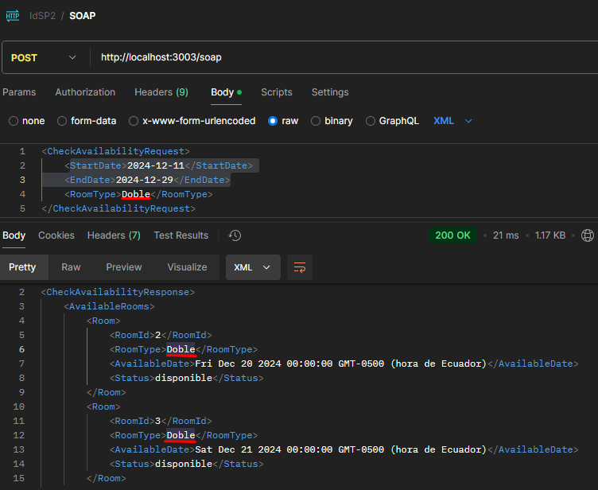
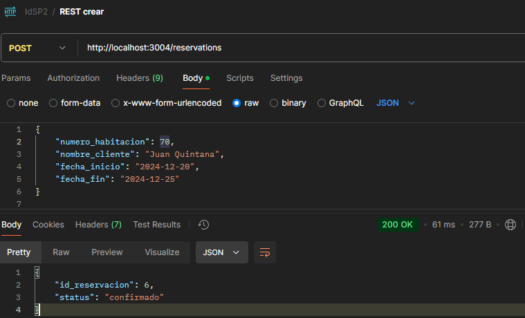
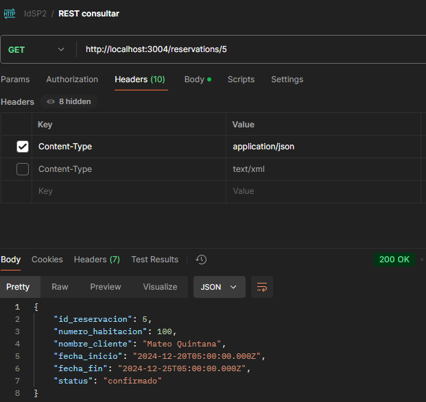

# Examen práctico 2 de integración de sistemas

## Scripts SQL para Bases de Datos:

### Servicio Web SOAP (Consulta de Disponibilidad)

```SQL
CREATE DATABASE habitaciones;
USE habitaciones;
CREATE TABLE disponibilidad (
    id_habitacion INT AUTO_INCREMENT PRIMARY KEY,
    tipo_habitacion VARCHAR(50),
    fecha_disponibilidad DATE,
    status ENUM('disponible', 'ocupado', 'mantenimiento')
);
```

Datos iniciales para probar funcionamiento

```SQL
INSERT INTO disponibilidad (id_habitacion, tipo_habitacion, fecha_disponibilidad, status)
VALUES
    (1, 'Unica', '2024-12-20', 'disponible'),
    (2, 'Doble', '2024-12-20', 'disponible'),
    (3, 'Doble', '2024-12-21', 'disponible'),
    (4, 'Suite', '2024-12-22', 'mantenimiento'),
    (5, 'Unica', '2024-12-23', 'disponible');
```

### API REST (Gestión de Reservas)

```SQL
CREATE DATABASE reservaciones;
USE reservaciones;
CREATE TABLE reservas (
    id_reservacion INT AUTO_INCREMENT PRIMARY KEY,
    numero_habitacion INT,
    nombre_cliente VARCHAR(100),
    fecha_inicio DATE,
    fecha_fin DATE,
    status ENUM('confirmado', 'cancelado')
);
```

### Microservicio (Gestión de Inventario)

```SQL
CREATE DATABASE inventario;
USE inventario;
CREATE TABLE habitaciones (
    id_habitacion INT AUTO_INCREMENT PRIMARY KEY,
    numero_habitacion INT,
    tipo_habitacion VARCHAR(50),
    status ENUM('disponible', 'ocupado', 'mantenimiento')
);
```

---

## Pruebas Documentadas:

### Servicio Web SOAP (Consulta de Disponibilidad)

Consulta de disponibilidad de las habitaciones según el tipo y un rango de fechas, devuelve una lista en un formato XML con las habitaciones correspondientes.
POST
http://localhost:3003/soap


### API REST (Gestión de Reservas)

Crea una reserva y devuelve el id del registro
POST
http://localhost:3004/reservations


Consulta una reserva específica, según su id el cual se lo debe colocar en la URI de la petición
GET
http://localhost:3004/reservations/_5_

