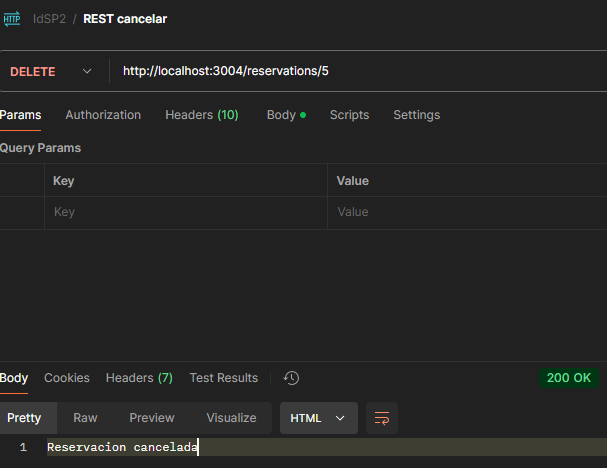
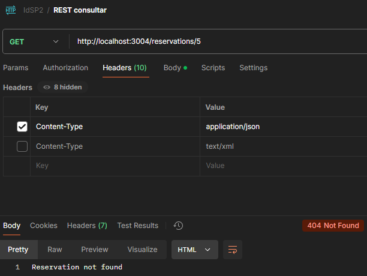
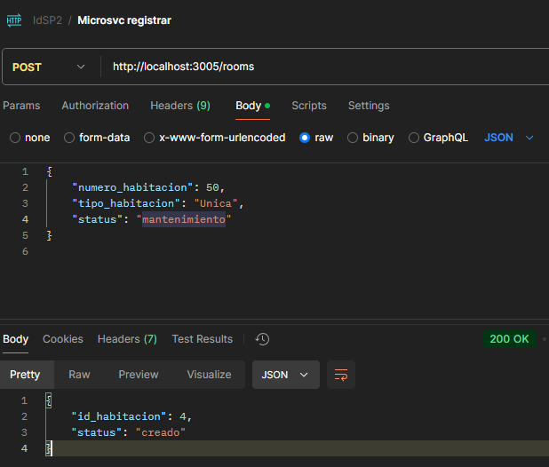
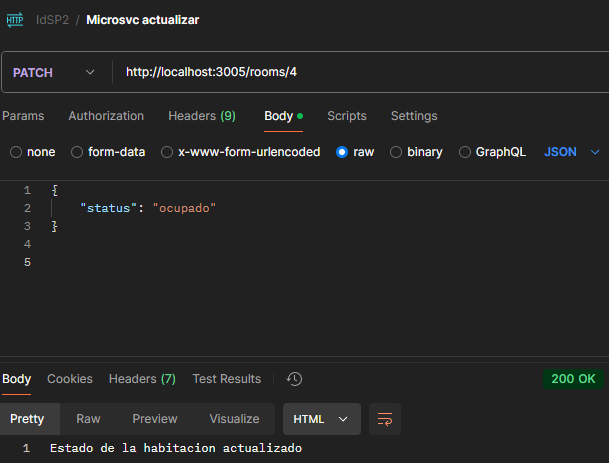
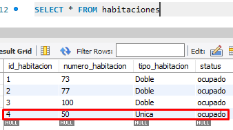

# Examen práctico 2 de integración de sistemas

## Scripts SQL para Bases de Datos:

### Servicio Web SOAP (Consulta de Disponibilidad)

```SQL
CREATE DATABASE habitaciones;
USE habitaciones;
CREATE TABLE disponibilidad (
    id_habitacion INT AUTO_INCREMENT PRIMARY KEY,
    tipo_habitacion VARCHAR(50),
    fecha_disponibilidad DATE,
    status ENUM('disponible', 'ocupado', 'mantenimiento')
);
```

Datos iniciales para probar funcionamiento

```SQL
INSERT INTO disponibilidad (id_habitacion, tipo_habitacion, fecha_disponibilidad, status)
VALUES
    (1, 'Unica', '2024-12-20', 'disponible'),
    (2, 'Doble', '2024-12-20', 'disponible'),
    (3, 'Doble', '2024-12-21', 'disponible'),
    (4, 'Suite', '2024-12-22', 'mantenimiento'),
    (5, 'Unica', '2024-12-23', 'disponible');
```

### API REST (Gestión de Reservas)

```SQL
CREATE DATABASE reservaciones;
USE reservaciones;
CREATE TABLE reservas (
    id_reservacion INT AUTO_INCREMENT PRIMARY KEY,
    numero_habitacion INT,
    nombre_cliente VARCHAR(100),
    fecha_inicio DATE,
    fecha_fin DATE,
    status ENUM('confirmado', 'cancelado')
);
```

### Microservicio (Gestión de Inventario)

```SQL
CREATE DATABASE inventario;
USE inventario;
CREATE TABLE habitaciones (
    id_habitacion INT AUTO_INCREMENT PRIMARY KEY,
    numero_habitacion INT,
    tipo_habitacion VARCHAR(50),
    status ENUM('disponible', 'ocupado', 'mantenimiento')
);
```

---

## Pruebas Documentadas:

### Servicio Web SOAP (Consulta de Disponibilidad)

Consulta de disponibilidad de las habitaciones según el tipo y un rango de fechas, devuelve una lista en un formato XML con las habitaciones correspondientes.
POST
http://localhost:3003/soap


### API REST (Gestión de Reservas)

Crea una reserva y devuelve el id del registro.

POST
http://localhost:3004/reservations


Consulta una reserva específica, según su id el cual se lo debe colocar en la URI de la petición; y devuelve la reservación con toda su información.

GET
http://localhost:3004/reservations/5


Elimina una reserva específica, según su id el cual se lo debe colocar en la URI de la petición; y devuelve la confirmación de que la reserva se ha cancelado.

DELETE
http://localhost:3004/reservations/5


Al volver a consultar, la reserva no se encuentra debido a que fue cancelada. Esto evidencia el funcionamiento de la petición anterior DELETE.



### Microservicio (Gestión de Inventario)

Crea una habitación con su número, tipo y estado; y devuelve su id

POST
http://localhost:3005/rooms


Actualiza el estado de una habitación y devuelve mensaje de confirmación del cambio

PATCH
http://localhost:3005/rooms/4


Se verifica en la consulta de la tabla habitaciones de la BD inventarios que el estado cambió, evidenciando el correcto funcinoamiento del PATCH.



**Link al video del funcionamiento:** https://udlaec-my.sharepoint.com/:f:/g/personal/alexander_quintana_udla_edu_ec/En3CH-1ZePVIhRLAIYIJ-LABm7paaKx1aJ-ItFbZpFiBig?e=Zog2pM

## Instrucciones de Ejecución:

- Antes que nada, se debe tener instalado node.js y MySQL
- En primer lugar se debe crear cada base de datos con su respectiva tabla en MySQL, con los scripts SQL que se enceuntran en una de las secciones anterirores de el presente documento.
- En cada archivo index.js que se encuentra en cada carpeta de los servicios SOAP, REST y Microservicios, se debe especificar correctamente los atributos para la conexión a la base de datos MySQL correspondiente a cada servicio:

```SQL
  host: "localhost",
  user: "tu_usuario",
  password: "tu_contraseña",
  database: "nombre_de_la_BD",
```

- Se debe ejecutar en primer lugar el SOAP, cambiando de directorio a disponibilidad_SOAP para ejecutar el index.js
- Se debe ejecutar después el API RESTful, cambiando de directorio a reservas_RSET para ejecutar el index.js
- Se debe ejecutar por último el Microservicio, cambiando de directorio a inventario_Microsvc para ejecutar el index.js

Para ejecutar cada archivo index.js se debe ejecutar el siguiente comando en la terminal: node index.js
Hay que recorda que se debe ubicar correctamente en cada directorio antes de ejecutar cada servicio.
